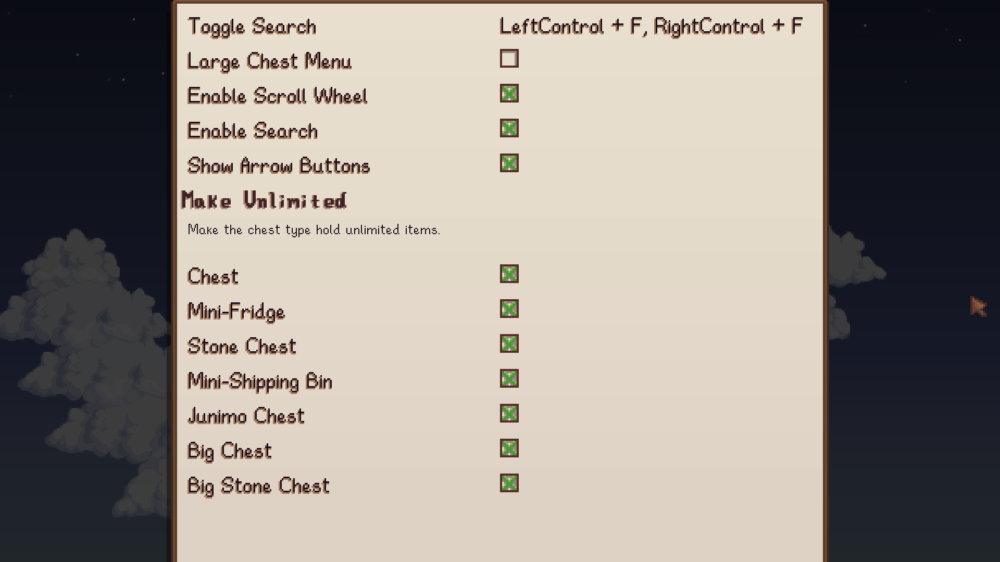
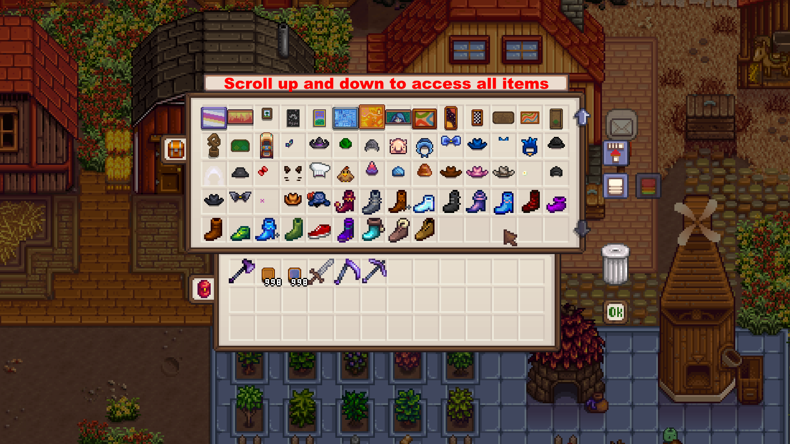
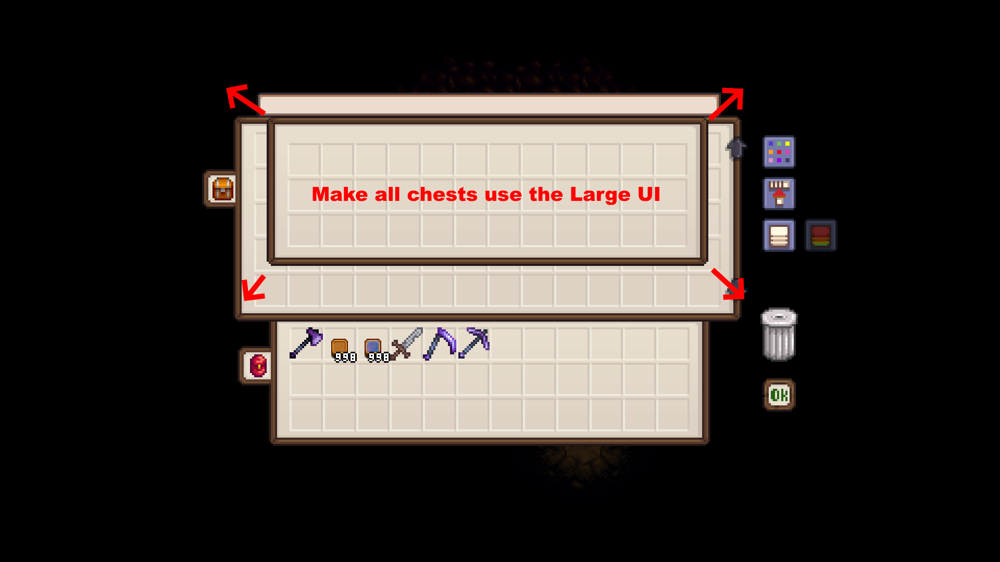
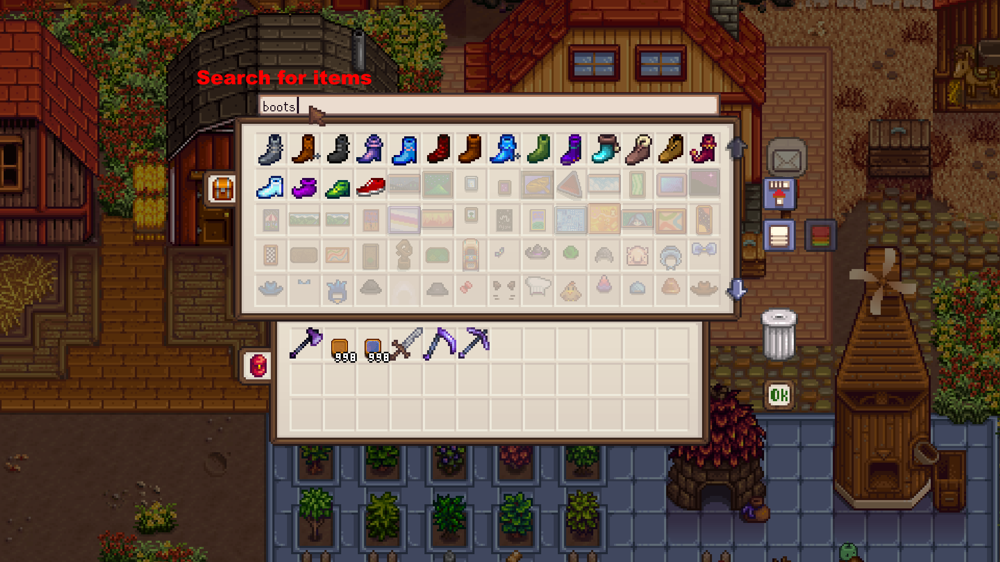

# Unlimited Storage

Stardew Valley mod which allows chests to hold unlimited items.

## Contents

- [Unlimited Storage](#unlimited-storage)
  - [Contents](#contents)
  - [Configurations](#configurations)
  - [Features](#features)
  - [Integration](#integration)
  - [Translations](#translations)


## Configurations

For ease of use, it is recommended to set config options
from [Generic Mod Config Menu](https://www.nexusmods.com/stardewvalley/mods/5098).



## Features

Chests can hold unlimited items.



Make the chest menu large by default.



Search for items.



## Integration

Target the chest at `Data/BigCraftables`.

Add `furyx639.UnlimitedStorage/Enabled` to custom fields:

```json
{
  "Changes": [
    {
      "Action": "EditData",
      "Target": "Data/BigCraftables",
      "TargetField": [ "YourChest.Id", "CustomFields" ],
      "Entries": {
        "furyx639.UnlimitedStorage/Enabled": "true"
      }
    }
  ]
}
```

## Translations

❌️ = Not Translated, ❔ = Incomplete, ✔️ = Complete

|            |         Unlimited Storage          |
| :--------- | :--------------------------------: |
| Chinese    | [❌️](UnlimitedStorage/i18n/zh.json) |
| French     | [❌️](UnlimitedStorage/i18n/fr.json) |
| German     | [❌️](UnlimitedStorage/i18n/de.json) |
| Hungarian  | [❌️](UnlimitedStorage/i18n/hu.json) |
| Italian    | [❌️](UnlimitedStorage/i18n/it.json) |
| Japanese   | [❌️](UnlimitedStorage/i18n/ja.json) |
| Korean     | [❌️](UnlimitedStorage/i18n/ko.json) |
| Portuguese | [❌️](UnlimitedStorage/i18n/pt.json) |
| Russian    | [❌️](UnlimitedStorage/i18n/ru.json) |
| Spanish    | [❌️](UnlimitedStorage/i18n/es.json) |
| Turkish    | [❌️](UnlimitedStorage/i18n/tr.json) |